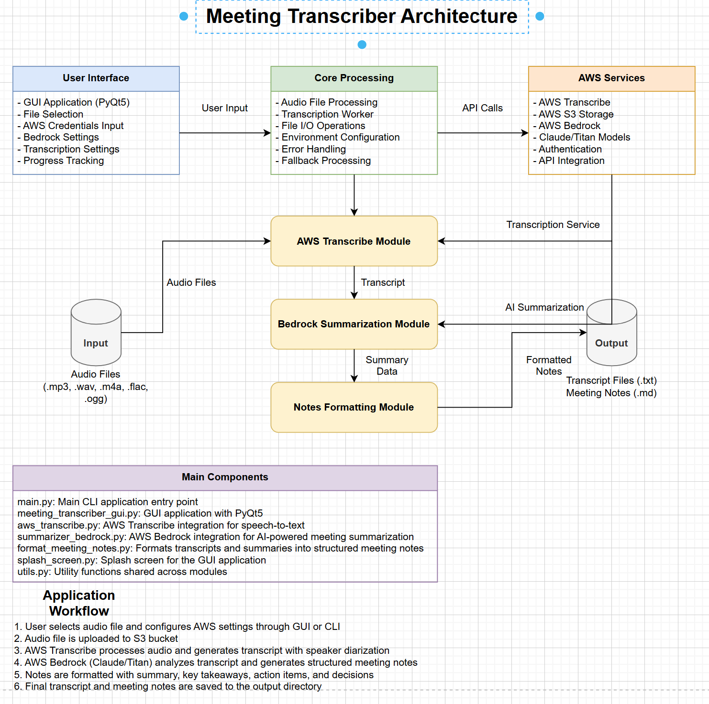
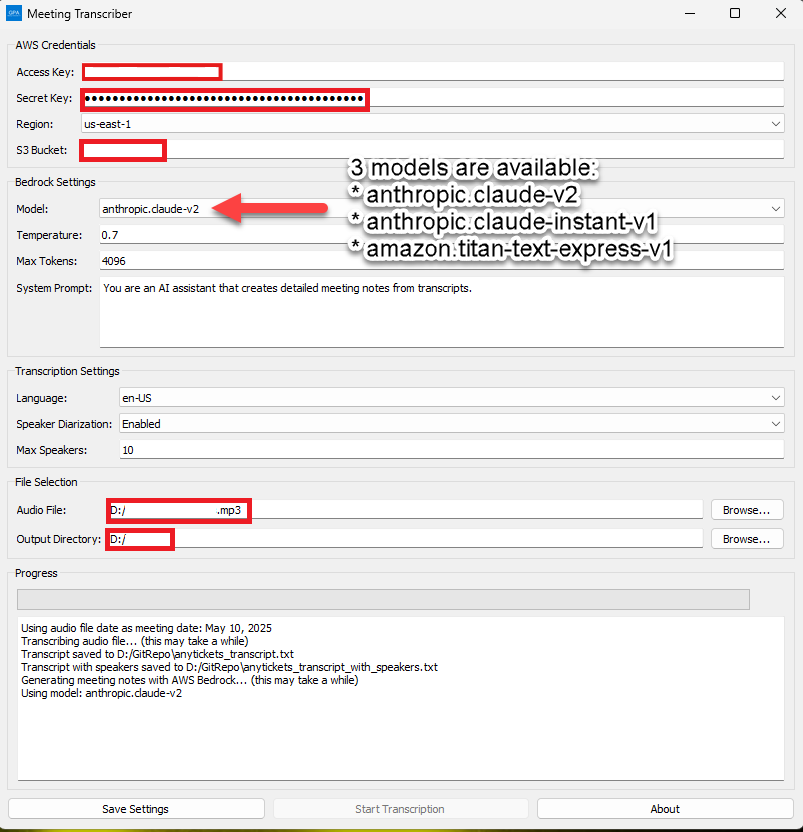

# Meeting Transcriber

A tool for transcribing meeting audio and generating detailed meeting notes using AWS services.

# Architectural Diagram
<div align="center">
  
</div>

# Application GUI
<div align="center">
  
</div>

## Features

- Transcribe audio files using AWS Transcribe
- Generate detailed meeting notes using AWS Bedrock
- Speaker diarization (identify different speakers)
- AI-powered summarization and action item extraction
- User-friendly GUI interface
- Splash screen for professional appearance
- Save and load settings

## Requirements

- Python 3.7+
- AWS Account with access to:
  - AWS Transcribe
  - AWS S3
  - AWS Bedrock
- AWS credentials with appropriate permissions

## Installation

### Using the Python Launcher (Recommended)

1. Download the latest release (`MeetingTranscriberPython.zip`) from the releases page
2. Extract all files to a folder of your choice
3. Run `Setup.bat` to:
   - Install required Python packages
   - Download NLTK data
   - Create desktop and Start menu shortcuts
   - Create a .env file from .env.example
4. Edit the .env file to add your AWS credentials
5. Launch the application using the created shortcuts or `LaunchApp.bat`

### From Source

1. Clone this repository
2. Install dependencies:
   ```
   pip install -r requirements.txt
   ```
3. Download NLTK data:
   ```
   python -c "import nltk; nltk.download('punkt'); nltk.download('stopwords')"
   ```
4. Run the GUI:
   ```
   python meeting_transcriber_gui.py
   ```

## Creating the Distribution Package

You can create the `MeetingTranscriberPython.zip` distribution package using the included PowerShell script:

1. Navigate to the project directory
2. Run the PowerShell script:
   ```
   cd installer
   powershell -ExecutionPolicy Bypass -File create_optimized_launcher.ps1
   ```
3. The script will create a `dist` folder containing:
   - `MeetingTranscriberPython` folder with all necessary files
   - `MeetingTranscriberPython.zip` ready for distribution

### What the Distribution Script Does

The `create_optimized_launcher.ps1` script:
1. Creates a clean distribution folder
2. Copies only essential Python files
3. Creates optimized versions of splash screen and main script
4. Generates setup and launch scripts
5. Packages everything into a ZIP file

### Files in the Distribution Package

| File | Purpose |
|------|---------|
| `meeting_transcriber_gui.py` | Main GUI application |
| `aws_transcribe.py` | AWS Transcribe integration |
| `format_meeting_notes.py` | Meeting notes formatting |
| `summarizer_bedrock.py` | AWS Bedrock integration |
| `utils.py` | Utility functions |
| `main.py` | Entry point with splash screen |
| `splash_screen.py` | Splash screen implementation |
| `Setup.bat` | Installation script |
| `LaunchApp.bat` | Application launcher |
| `Uninstall.bat` | Uninstallation script |
| `requirements.txt` | Python dependencies |
| `.env.example` | Example environment variables |
| `icon.ico` | Application icon |
| `assets/SplashScreen.png` | Splash screen image |
| `README.txt` | Installation instructions |

## Setting Up AWS

### AWS Account Requirements

To use Meeting Transcriber, you need an AWS account with access to:
- AWS Transcribe service
- AWS Bedrock service
- AWS S3 service

### Creating AWS Access Keys

1. Log in to the AWS Management Console
2. Click on your username in the top-right corner
3. Select "Security credentials"
4. Under "Access keys", click "Create access key"
5. Download or note your Access Key ID and Secret Access Key

### Setting Up an S3 Bucket

1. Go to the S3 service in the AWS Management Console
2. Click "Create bucket"
3. Enter a unique bucket name
4. Configure bucket settings (default settings are usually fine)
5. Click "Create bucket"

### Enabling AWS Bedrock Access

1. Go to the AWS Bedrock service in the AWS Management Console
2. Request access to the models you want to use (Claude, Titan, etc.)
3. Wait for approval (this may take some time)

## Using the Application

### Configuring AWS Settings

1. Enter your AWS Access Key ID and Secret Access Key
2. Select your AWS Region
3. Enter your S3 Bucket name
4. Click "Save Settings" to store your credentials

### Configuring Bedrock Settings

1. Select the Bedrock model to use (Claude v2 recommended)
2. Set the temperature (0.7 is a good default)
3. Set the maximum tokens (4096 is usually sufficient)
4. Customize the system prompt if desired

### Configuring Transcription Settings

1. Select the language of the audio recording
2. Enable or disable speaker diarization
3. Set the maximum number of speakers (if diarization is enabled)

### Transcribing a Meeting

1. Click "Browse..." next to "Audio File" to select your meeting recording
2. Click "Browse..." next to "Output Directory" to choose where to save the results
3. Click "Start Transcription" to begin the process
4. Monitor progress in the log area

## Understanding the Results

### Output Files

The application generates several files in your chosen output directory:
- `[filename]_transcript.txt`: The raw transcript text
- `[filename]_transcript_with_speakers.txt`: Transcript with speaker labels (if diarization was enabled)
- `[filename]_meeting_notes.md`: Formatted meeting notes in Markdown format

### Meeting Notes Structure

The meeting notes include:
1. **Summary**: A comprehensive overview of the meeting
2. **Key Takeaways**: Important points organized by category
3. **Decisions Made**: Key decisions from the meeting
4. **Action Items**: Tasks with assigned owners (if mentioned)
5. **Participants**: List of meeting participants
6. **Full Transcript**: Reference to the full transcript file

## Troubleshooting

### Common Issues

#### AWS Connection Errors

- **Error**: "Invalid credentials" or "Access denied"
  - **Solution**: Verify your AWS credentials are correct and have the necessary permissions

- **Error**: "Bucket not found"
  - **Solution**: Confirm your S3 bucket name is correct and the bucket exists

#### Transcription Errors

- **Error**: "Unsupported media format"
  - **Solution**: Convert your audio to a supported format (MP3, WAV, M4A, FLAC, OGG)

- **Error**: "File too large"
  - **Solution**: Split large audio files into smaller segments

#### AI Summarization Errors

- **Error**: "Model not found" or "Access denied to model"
  - **Solution**: Ensure you have requested and been granted access to the Bedrock model

- **Error**: "Token limit exceeded"
  - **Solution**: Reduce the max tokens setting or use a model with higher token limits

## Uninstallation

To uninstall the application:

1. Run `Uninstall.bat` from the installation directory
2. Follow the on-screen instructions
3. The uninstaller will:
   - Remove desktop and Start menu shortcuts
   - Remove configuration files
   - Remove the virtual environment
   - Optionally remove all application files

## Project Structure

### Root Directory Files

| File | Purpose |
|------|---------|
| `meeting_transcriber_gui.py` | Main GUI application with PyQt5 interface |
| `main.py` | Command-line version of the application |
| `aws_transcribe.py` | AWS Transcribe service integration |
| `summarizer_bedrock.py` | AWS Bedrock integration for AI summarization |
| `format_meeting_notes.py` | Functions for formatting meeting notes |
| `splash_screen.py` | Splash screen implementation for GUI |
| `utils.py` | Utility functions used across the application |
| `requirements.txt` | Python package dependencies |
| `.env.example` | Example environment variables file |
| `icon.ico` | Application icon for Windows |
| `README.md` | Project documentation |
| `Uninstall.bat` | Script to uninstall the application |

### Installer Directory Files

| File | Purpose |
|------|---------|
| `create_optimized_launcher.ps1` | PowerShell script to create distribution package |
| `.env.example` | Example environment variables for distribution |
| `icon.ico` | Application icon for distribution |
| `Assets/SplashScreen.png` | Splash screen image for distribution |

## Support

For support, please contact: albaneg@yahoo.com

## License

MIT